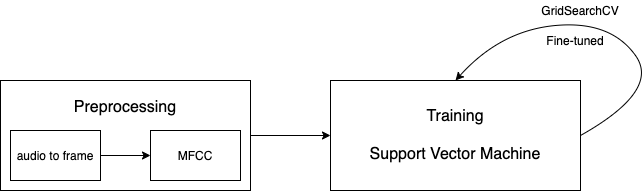
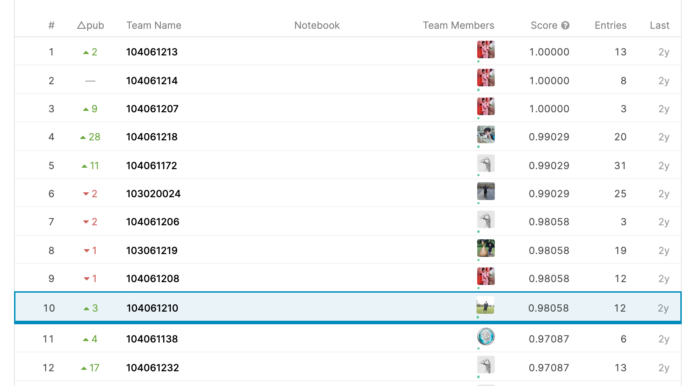

# Laughter and Speech Detection and Prediction
## Introduction
This project has a [Kaggle competition](https://www.kaggle.com/c/DSPLAB-Laughter-Detection)

This project uses three method:
1. **RBF SVM** as model
2. **GridSearchCV** for fine-tune
3. **Cross Validation** to evaluate accuracy

## Workflow

## Leaderboard (Private Score)

